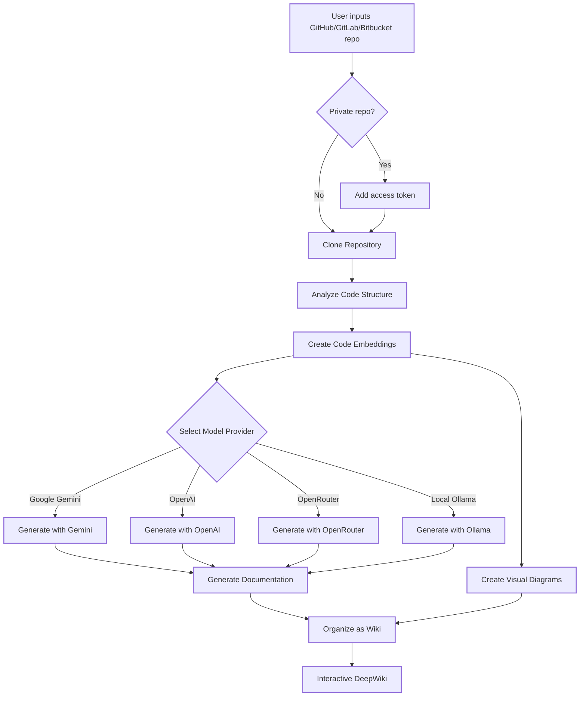

# 🔍 How It Works

DeepWiki uses AI to:

1. Clone and analyze the GitHub, GitLab, or Bitbucket repository (including private repos with token authentication)
2. Create embeddings of the code for smart retrieval
3. Generate documentation with context-aware AI (using Google Gemini, OpenAI, OpenRouter, or local Ollama models)
4. Create visual diagrams to explain code relationships
5. Organize everything into a structured wiki
6. Enable intelligent Q&A with the repository through the Ask feature
7. Provide in-depth research capabilities with DeepResearch

